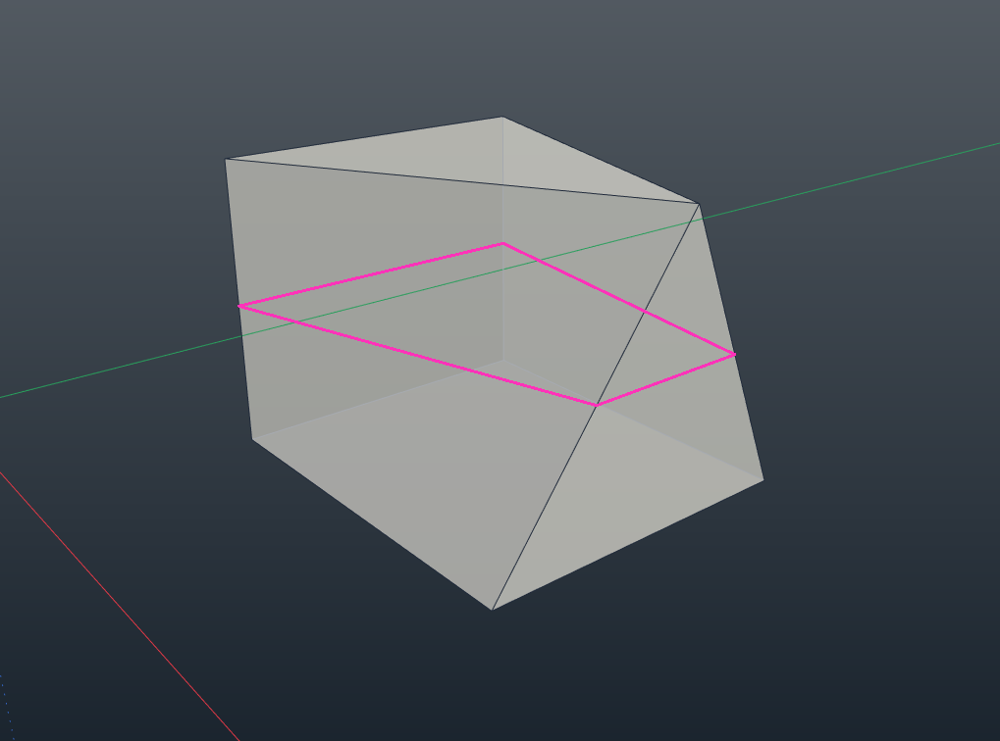
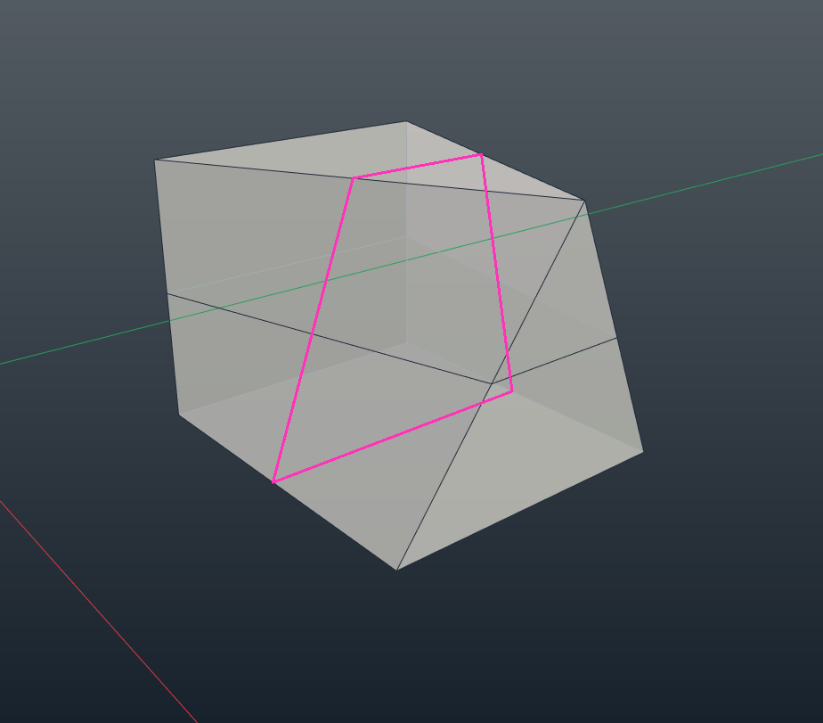

# Loop Cut para IngeTrazo

Extensión independiente para insertar **un anillo de aristas** en una malla cerrada. Muestra una vista previa rosa antes de aplicar el corte. El archivo instalable es [`loop_cut.py`](loop_cut.py).

**Versión:** `v1.0` · **Licencia:** MIT · **Autor:** Daniel Wagner

## Demostración visual

Las dos imágenes son ejemplos independientes de orientación del corte; no representan fotogramas consecutivos.

**Sección transversal:**

**Sección en otra orientación:**

## Instalación

1. Descarga [`loop_cut.py`](loop_cut.py).
2. En IngeTrazo, abre **Extensiones → Abrir carpeta de plugins**. En Windows suele ser `%APPDATA%\ingetrazo\plugins\`.
3. Copia el archivo `.py` a esa carpeta y reinicia IngeTrazo.

La herramienta aparece en **Extensiones** y crea su propia barra **LoopTools**, con un icono rosa.

## Uso

1. Activa **Corte em loop** desde el menú o su barra.
2. Sitúa el cursor sobre una arista compartida por dos caras. La línea rosa muestra el corte previsto.
3. Haz clic para crear el anillo. **Ctrl+Z** deshace la operación completa.

El corte se sitúa en el centro de la arista elegida; esta versión no permite deslizar el anillo ni elegir una posición numérica.

## Cómo calcula el corte

En una banda cerrada de cuadriláteros, la extensión sigue las aristas opuestas de cada cara e inserta los puntos medios. Si ese recorrido no es válido, intenta una sección plana perpendicular a la arista elegida. Esto permite atravesar algunas piezas con triángulos y polígonos de más lados, siempre que cada cara tenga exactamente dos intersecciones y el recorrido forme un anillo cerrado.

Antes de cambiar la malla, comprueba que cada cara puede dividirse por el segmento previsto. Descarta bordes abiertos, caras con agujeros, intersecciones sobre vértices existentes y recorridos ramificados o ambiguos. Al confirmar, divide las aristas compartidas y las caras afectadas, conserva los atributos de las caras y registra toda la operación como un único paso de deshacer.

**Alcance:** trabaja sobre la malla activa. Admite las API de plugins 1 y 2; la API de IngeTrazo puede cambiar durante la serie 0.x. Las comprobaciones previas reducen errores de topología, pero no garantizan que cualquier geometría arbitraria pueda cortarse.

## English

Loop Cut inserts an edge ring in a closed mesh, with a pink preview and one-step undo. It traces opposite edges through a closed quad strip; for suitable mixed-face meshes, it tries a planar cross-section perpendicular to the selected edge. Open or ambiguous paths are rejected. Install `loop_cut.py` in IngeTrazo's plugins folder and restart the application.

## Português

O Loop Cut insere um anel de arestas numa malha fechada, com prévia rosa e um único passo de desfazer. Ele percorre as arestas opostas de uma faixa de quadriláteros ou tenta uma seção plana perpendicular à aresta escolhida em algumas malhas de faces mistas. Percursos abertos ou ambíguos são recusados. Instale `loop_cut.py` na pasta de plugins do IngeTrazo e reinicie o programa.

## Licencia

MIT. Consulta [LICENSE](LICENSE).
